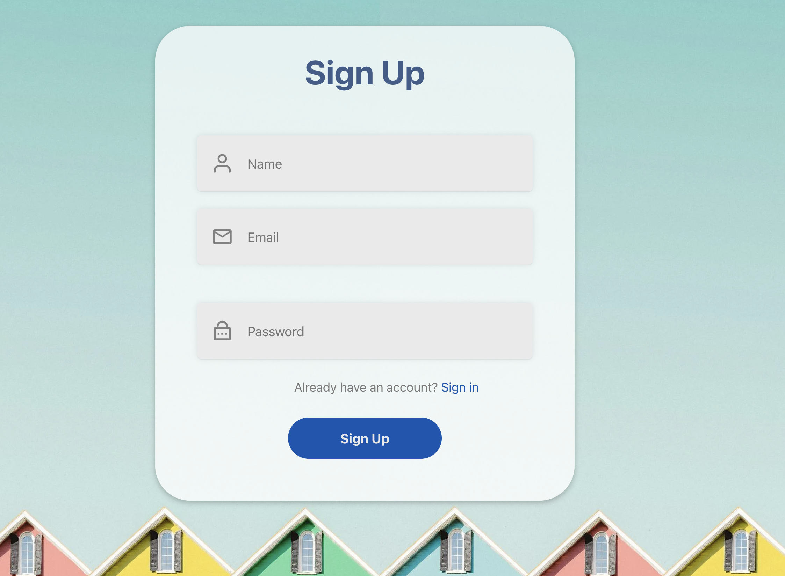
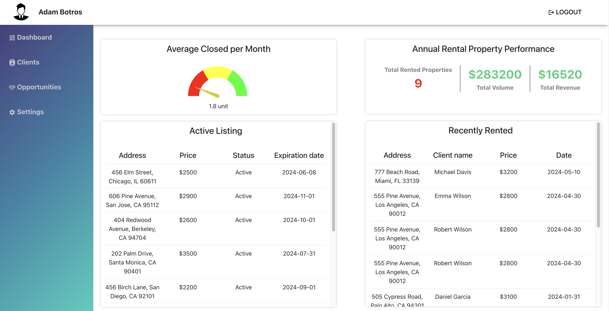
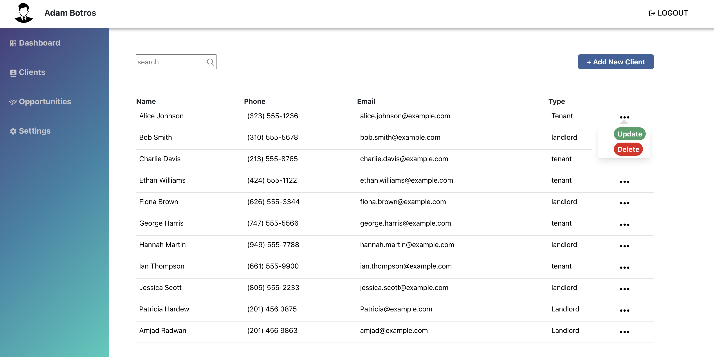
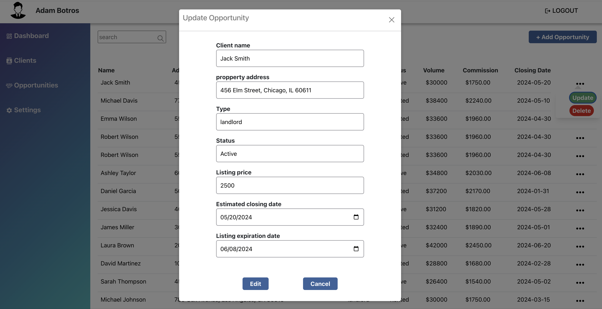

# Real Estate Management System

A full stack comprehensive Real Estate Management System built with React and Node.js, designed for Agents to manage clients and opportunities efficiently. The application includes user authentication, client management, opportunity, and performance tracking features.

## Features

- User Authentication (Sign Up, Login, Logout)
- Dashboard with an overview of Active listing and closed opportunities, and performance tracking.
- Client Management (Add, Update, Delete)
- Opportunity Management (Add, Update, Delete)
- Context API for state management

## Usage

### Authentication

- Sign Up: Users can create an account by providing name ,email, and password
- Login: Registered users can log in with their credentials
- Logout: Logged-in users can log out using the logout button.

### Client Management

- View Clients: Navigate to the clients page to view a list of all clients.
- Add Client: Click the "Add New Client" button to open a form for adding a new client.
- Update Client: Click the "Update" button next to a client to open a form for updating client details.
- Delete Client: Click the "Delete" button next to a client to remove them from the list.

### Opportunity Management

- View Opportunities: Navigate to the opportunities page to view a list of all opportunities.
- Add Opportunity: Click the "Add New Opportunity" button to open a form for adding a new opportunity.
- Update Opportunity: Click the "Update" button next to an opportunity to open a form for updating opportunity details.
- Delete Opportunity: Click the "Delete" button next to an opportunity to remove it from the list.

### Routes

The application uses React Router to manage navigation between different pages. Here are the available routes:

- /: The home route which loads the SignUp component.
- /login: The login route which loads the Login component.
- /logout: The logout route which loads the Logout component.
- /dashboard: The dashboard route which loads the Dashboard component, displaying an overview of performance and properties.
- /clients: The clients route which loads the Clients component, allowing users to manage client information.
- /opportunities: The opportunities route which loads the Opportunities component, allowing users to manage opportunity information.

### Additional features that could be added to the application

- Search Functionality: Implement a search feature to allow users to quickly find specific clients or opportunities based on various criteria such as name, address, status
- Document Management: upload and store documents related to clients and opportunities, such as contracts, agreements, and client records

## GITHUB Link

https://github.com/Hrais12/Capstone-Project-
