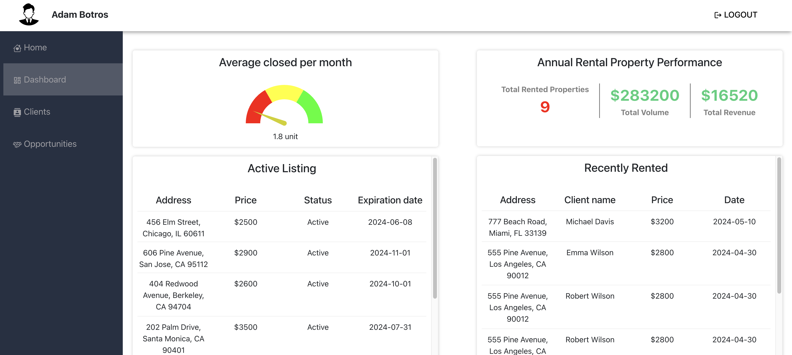
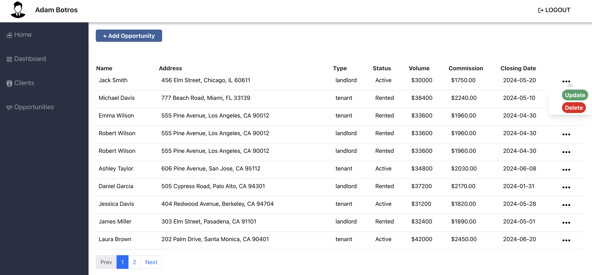
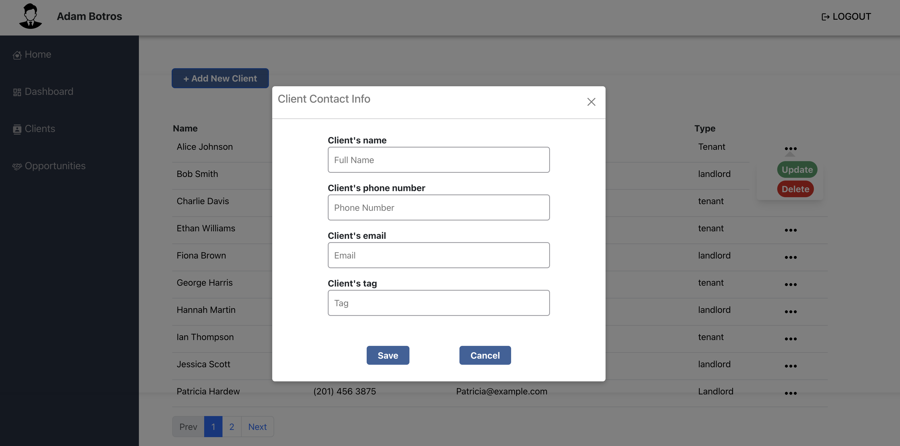

# Real Estate Management System

A comprehensive Real Estate Management System built with React, designed for Agents to manage clients and opportunities efficiently. The application includes user authentication, client management, and opportunity tracking features.

## Features

- User Authentication (Sign Up, Login, Logout)
- Dashboard with an overview of Active listing and closed opportunities, and performance tracking.
- Client Management (Add, Update, Delete)
- Opportunity Management (Add, Update, Delete)
- Context API for state management

## Usage

### Authentication

- Sign Up: Users can create an account by providing name ,email, and password
- Login: Registered users can log in with their credentials
- Logout: Logged-in users can log out using the logout button.

### Client Management

- View Clients: Navigate to the clients page to view a list of all clients.
- Add Client: Click the "Add New Client" button to open a form for adding a new client.
- Update Client: Click the "Update" button next to a client to open a form for updating client details.
- Delete Client: Click the "Delete" button next to a client to remove them from the list.

### Opportunity Management

- View Opportunities: Navigate to the opportunities page to view a list of all opportunities.
- Add Opportunity: Click the "Add New Opportunity" button to open a form for adding a new opportunity.
- Update Opportunity: Click the "Update" button next to an opportunity to open a form for updating opportunity details.
- Delete Opportunity: Click the "Delete" button next to an opportunity to remove it from the list.

### Additional features that could be added to the application

- Search Functionality: Implement a search feature to allow users to quickly find specific clients or opportunities based on various criteria such as name, address, status
- Document Management: upload and store documents related to clients and opportunities, such as contracts, agreements, and client records
